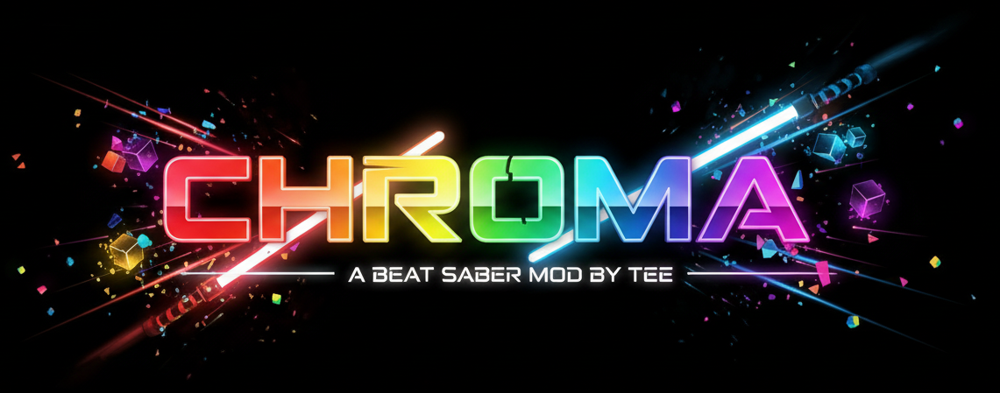

  

> [!IMPORTANT]
> - ChromaTeeK is currently available only for Beat Saber version **1.40.8_7379** (which is the latest moddable version)
> - As of 22/01/2026 the mod has undergone excessive developer testing and roughly 5 hours of in-game testing without any major issues observed (read *Known Bugs* section below). Please, share your feedback.

 

**Description:** 
- ChromaTeeK is a maintained version of the **Chroma** Beat Saber PC mod.
- It preserves Chroma's in-game behaviour (maps and other mods will still recognise it as "Chroma") while using a distinct distributable name so it’s easy to distinguish between different Chroma builds.

**What it does:**
- Brings Chroma lighting, colorizers and environment enhancements to Beat Saber on **Quest**.
- Keeps compatibility so existing Chroma-compatible maps and plugins recognize and work with it.

**Version / Testing Notes:**
- Renamed package to "ChromaTeeK" (I know, cheeky) to avoid confusion with other Chroma releases.

**Tested Platform:** 
- Meta Quest 3 (tested only on Quest 3 so far. If you test on other devices and have feedback, please report it so this project can expand compatibility testing.)

> [!IMPORTANT]
> **Maintenance:**
> - If appreciated (↓), I will do my best to keep ChromaTeeK alive and updated for every major Beat Saber update.

  

> [!WARNING]
> **Known Bugs / Limitations:**
> - Old maps (created via older engines) may be laggy. This is a behaviour of engine differences and map optimizations, not something introduced by my work.
> - No other issues are currently known — if you find something, please open an issue.
> - **Reporting Issues:**
>   - Please open a new issue in this repository if you encounter bugs or unexpected behaviour.
>   - Don't forget detailed description with all how's, when's, etc...
>   - Include your device name, steps to reproduce and any relevant logs.
> 

**Credits:**
- Original Chroma created by Aeroluna (thank you 🙏🙏🙏— original work from ~5 years ago is the foundation of this project).

 

---
_I don't think that any installation instructions are needed..._

_If you're here, you know what you're doing - but just in case..._

_I use QuestPatcher for installation of mods (any other installer should work too (eg BMF)_
